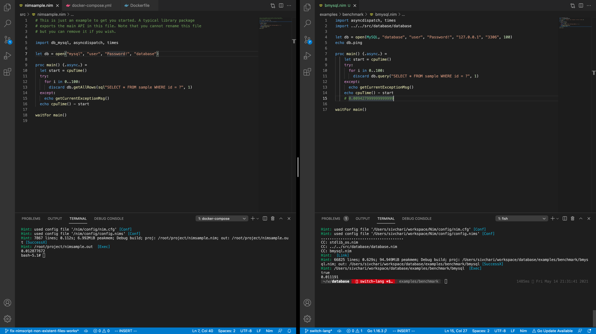

# database

[](https://github.com/sivchari/database/actions/workflows/nim_test.yml)
[](https://github.com/sivchari/database)

database provides intuitive DB methods.  
Just by using this library, you can use MySQL, PostgreSQL, and SQLite.  
By using connection pooling, parallel DB processing can be done at high speed.

## Installation
```shell
nimble install https://github.com/sivchari/database
```

## Example
### MySQL
```nim
import ../src/database/database

let db = open(MySQL, "database", "user", "Password!", "mysql", "3306", 10)
echo db.ping

let drop = "DROP TABLE IF EXISTS sample"
discard mysql.query(drop)

let create = """CREATE TABLE IF NOT EXISTS `database`.`sample` (
   `id`  INT(11)
  ,`age` INT(11)
  ,`name` VARCHAR(30)
)"""
discard mysql.query(create)

echo "insert"
discard db.query("INSERT INTO sample(id, age, name) VALUES(?, ?, ?)", 1, 10, "New Nim")

echo "select"
let row = db.query("SELECT * FROM sample WHERE id = ?", 1)

echo "update"
let stmt1 = db.prepare("UPDATE sample SET name = ? WHERE id = ?")
discard stmt1.exec("Change Nim", 1)

echo "delete"
let stmt2 = db.prepare("DELETE FROM sample WHERE id = ?")
discard stmt2.exec(1)

echo row.all
echo row[0]
echo row.columnTypes
echo row.columnNames

db.transaction:
  let stmt3 = db.prepare("UPDATE sample SET name = ? WHERE id = ?")
  discard stmt3.exec("Rollback Nim", 1)
  raise newException(Exception, "rollback")

discard db.close
```

### PostgreSQL
```nim
import ../src/database/database

let db = open(PostgreSQL, "database", "user", "Password!", "postgres", "5432", 1)
echo db.ping

let drop = "DROP TABLE IF EXISTS sample"
discard postgres.query(drop)

let create = """create table sample (
  id integer not null,
  age integer not null,
  name varchar not null
)"""
discard postgres.query(create)

echo "insert"
discard db.query("INSERT INTO sample(id, age, name) VALUES($1, $2, $3)", 1, 10, "New Nim")

echo "select"
let row = db.query("SELECT * FROM sample WHERE id = $1", 1)

echo "update"
let stmt1 = db.prepare("UPDATE sample SET name = $1 WHERE id = $2")
discard stmt1.exec("Change Nim", 1)

echo "delete"
let stmt2 = db.prepare("DELETE FROM sample WHERE id = $1")
discard stmt2.exec(1)

echo row.all
echo row[0]
echo row.columnTypes
echo row.columnNames

db.transaction:
  let stmt3 = db.prepare("UPDATE sample SET name = $1 WHERE id = $2")
  discard stmt3.exec("Rollback Nim", 1)
  raise newException(Exception, "rollback")

discard db.close
```

### SQLite
```nim
import ../src/database/database

let db = open(SQLite3, "sample.sqlite3")
echo db.ping

let drop = "DROP TABLE IF EXISTS sample"
discard sqlite.query(drop)

let create = """CREATE TABLE IF NOT EXISTS sample (
     id INT
    ,age INT
    ,name VARCHAR
)"""
discard sqlite.query(create)

echo "insert"
discard db.query("INSERT INTO sample(id, age, name) VALUES(?, ?, ?)", 1, 10, "New Nim")

echo "select"
let row = db.query("SELECT * FROM sample WHERE id = ?", 1)

echo "update"
let stmt1 = db.prepare("UPDATE sample SET name = ? WHERE id = ?")
discard stmt1.exec("Change Nim", 1)

echo "delete"
let stmt2 = db.prepare("DELETE FROM sample WHERE id = ?")
discard stmt2.exec(1)

echo row.all
echo row[0]
echo row.columnTypes
echo row.columnNames

discard db.close
```

## Cross Compile

### Mac
```shell
GOARCH=arm64 CGO_ENABLED=1 go build -buildmode=c-shared -o sql_arm64.so *.go
GOARCH=amd64 CGO_ENABLED=1 go build -buildmode=c-shared -o sql_amd64.so *.go
```

### Linux
```shell
docker-compose up --build -d linux-compile
docker-compose exec linux-compile
go get golang.org/dl/go1.16
go1.16 download
CGO_ENABLED=1 go1.16 build -buildmode=c-shared -o sql_linux_amd64.so *.go
```

### Windows
```shell
docker-compose up --build -d windows-compile
docker-compose exec windows-compile
apt -y update
apt -y install gcc-multilib
apt -y install gcc-mingw-w64
apt -y install binutils-mingw-w64
GOOS=windows GOARCH=amd64 CGO_ENABLED=1 CXX=x86_64-w64-mingw32-g++ CC=x86_64-w64-mingw32-gcc go build -buildmode=c-shared -o sql_windows_amd64.dll *.go
```

## Benchmark

There is an official database library for Nim, but it does not implement connection pooling.
However, this library (database) allows connection pooling to be set at connection time.
This library (database) implicitly sets the same value as the connection pool as idle connection when connecting.

Here is a benchmark of the official db_mysql and 100 queries run with async


